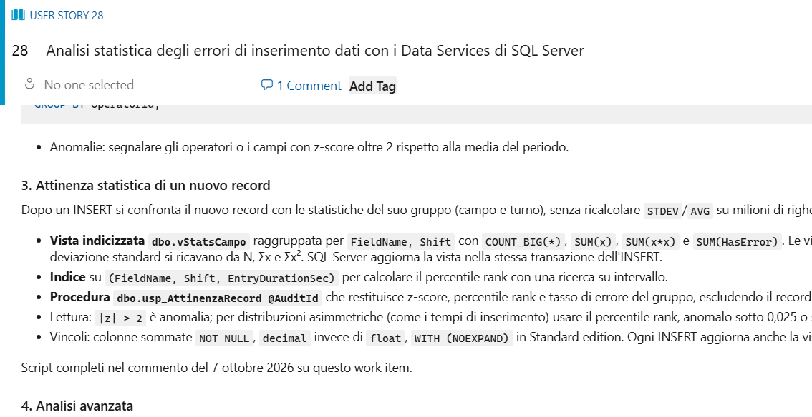
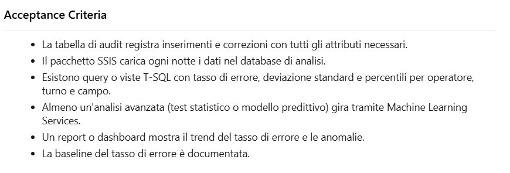
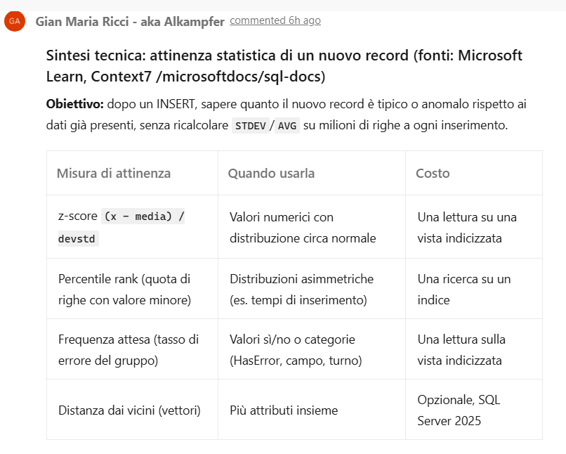
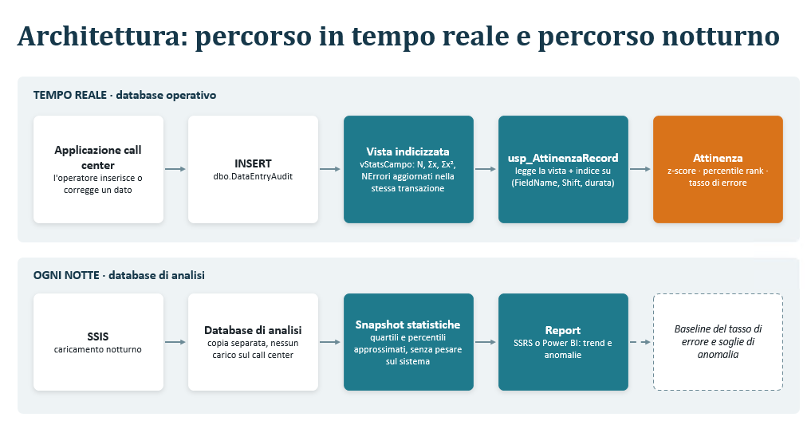

## The situation

I was doing a course, on Azure DevOps, but you know, AI coding is something that is constantly in every discussion so the demo was: how can you use claude code **for something that is not a real coding problem**

## The example

We were talking about how to generate a good backlog, and at a certain point the takeaway is: **you need to generate detailed stories and you can use the AI to help**. In the example we were working with a fictional customer that needs to use SQL server functionalites to identify if a record is statistically coherent with the existing data in a table. 

The mood is: Customer has a problem (a feature) where it has bad data in database, this should be prevented, and one of the possible solution is to use SQL server to try to identify suspicious records. This is a feature that is well know but clearly you can miss some details.

Now if you have Claude Code connected to Context7 and Microsoft Learn (with MCP or other connections) you can ask Claude Code to read the issue, and then start performing a technical analysis explaining how to structure the solution but also giving links to relevant documentation, tutorials, and best practices.

## The prompt

I didn't issue a complex prompt, i use my [azdo-cli tool](https://github.com/alkampfergit/azdo-cli) to interact with Azure DevOps. I use a custom tool because I can have functions that are tailored to my use-cases and to be used by an agent. It started as a simple tool that can simply create and manage work items, but over time I added more capabilities to support pipeline etc. It is completely vibe coded with GitHub SpecKit using GH as a base harness.

Thanks to these connection I asked to search documentation about what is written in the description of WorkItem 28 then update with details and also generate a PowerPoint with diagrams that helps us to understand the technique. I asked also to include links to documentation **directly in the PowerPoint Notes**.

## The result

Even with a simple prompt, Claude was able to find information in relevant sources, elaborate and analyze those informations, and generate a PowerPoint with diagrams. The PowerPoint is especially useful because Claude is quite good in generating presentation targeted to explain concepts. This helps a lot a user to quickly grasp complex technical details and make informed decisions based on the analysis provided. So what I have is a nice Azure DevOps Work Item.



Then you can create a Skill that specify exactly what you want to obtain, as an example you can require Claude to generate a brief list for acceptance criteria.



The acceptance criteria is really simple, it is just a bullet list of conditions, but you can instruct claude to add more detailed explanations. Then I want to be super sure that the information are correct, and are **not allucinations that generated from memory of the model** so I ask to check Context7 and Microsoft Learn and add a comment to the work item with all the details that are verified.



As I specified before, I asked **Claude to generate a PowerPoint, rich in diagram to explain the general technique**. It seems to me that when you ask Claude to generate a presentation to explain something, the result is effective, because a PowerPoint is the typical artifact used to explain something.



Since PowerPoint is made for such kind of information, schemas, graphics is more appealing and effective in conveying complex ideas compared to plain text or mermaid diagrams. Also I force it to write in PowerPoint Slide notes all the links that were used to generate the explanations. So I have notes like thes

In alto il percorso in tempo reale: la vista indicizzata è mantenuta da SQL Server a ogni INSERT, quindi la procedura non deve scorrere la tabella. In basso il percorso notturno già previsto dal work item: SSIS carica il database di analisi, dove si calcolano percentili e report.

```
Documentazione:
- Create indexed views: https://learn.microsoft.com/sql/relational-databases/views/create-indexed-views?view=sql-server-ver17
- Context7 · Create DML triggers to handle multiple rows of data: https://github.com/microsoftdocs/sql-docs/blob/live/docs/relational-databases/triggers/create-dml-triggers-to-handle-multiple-rows-of-data.md
- Context7 · Use the inserted and deleted tables: https://github.com/microsoftdocs/sql-docs/blob/live/docs/relational-databases/triggers/use-the-inserted-and-deleted-tables.md
- APPROX_PERCENTILE_CONT (Transact-SQL): https://learn.microsoft.com/sql/t-sql/functions/approx-percentile-cont-transact-sql?view=sql-server-ver17
```
That allows the reader to check the real Microsoft Documentation to avoid allucinations. All of this was produced in less than 10 minutes of working of Claude Opus 5.5 from a single prompt. The ability **to use Azdo-cli commandline (or similar alternative) allows the agent to be integrated in the process, using the same centralized tool (Azure DevOps) and behaving like a normal human participant.**

## Conclusion

In conclusion, using Claude in combination with a custom Azdo-cli can be used not for coding, but instead to help grooming the backlog, expanding user stories, perform researches, and everything related to managing and maintaining the Backlog.

> Now the cost of code is lowering, you can finally spend more time on Backlog (you really had to before).

Gian Maria.