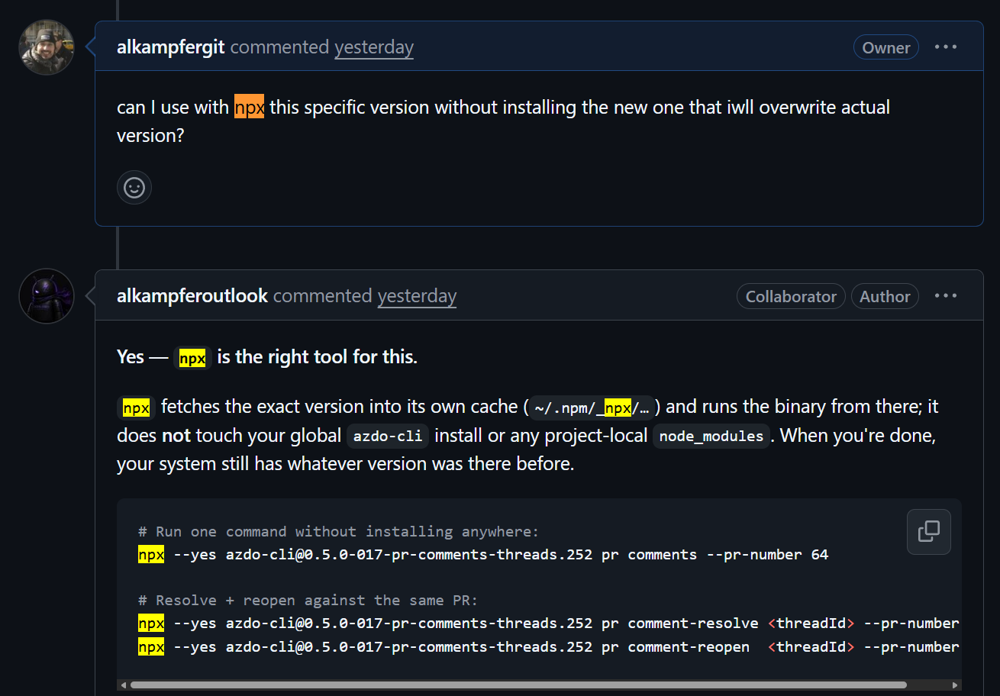

> **This is a follow-up** to [GitHub as a Primitive Control Plane for Spec-Driven Agents](../github-control-plane-for-spec-driven-agents). That post covered the outer loop — labels, queues, and the speckit pipeline. This one focuses on a smaller but equally important benefit: because all communication happens on the GitHub thread, you can **ask the agent questions in exactly the same way you would ask a human collaborator**.

## What the Screenshot Shows

In the previous post I described a design where the agent posts every spec, plan, and clarification question on the GitHub issue or pull request thread. It waits for the repository owner to reply before advancing.

What I did not emphasize is that this channel is bidirectional.

***Figure 1:*** *A real dialogue on a GitHub PR thread — the owner asks about npx versioning, the agent answers with full context*

The screenshot shows a real exchange on a pull request thread. I asked the agent a practical question:

> can I use with npx this specific version without installing the new one that will overwrite actual version?

The agent answered directly, accurately, and in the same place:

> Yes — `npx` is the right tool for this. `npx` fetches the exact version into its own cache (`~/.npm/_npx/…`) and runs the binary from there; it does **not** touch your global `azdo-cli` install or any project-local `node_modules`. When you're done, your system still has whatever version was there before.

It also included concrete command examples for the specific version being discussed. **This is not a canned response. It is a contextual answer from an agent that already has full knowledge of the repository, the PR, and the tool in question**.

## Why This Matters

A collaborator is not an entity that gets task assigned and output the result, is a partner in a team and you should be able to ask questions, hint, etc. When you design an AI assisted coding agent **it makes sense that it has the same ability of a human collaborator**. As for the previous example I should be able to ask for clarifications or instructions.

The `speckit-gh` design changes this. Because the agent is already polling the thread for state-changing directives, it also naturally handles questions. The same polling loop that watches for "approved" or "needs changes" also sees "can I use npx for this?" and responds.

The result is something closer to **pair programming with an asynchronous partner** than to reviewing output from a pipeline.

## The Practical Value of In-Thread Answers

There are several concrete reasons why getting answers on the GitHub thread is better than asking in a separate chat session.

**Context is shared and persistent.** When I ask the question on the PR thread, the agent already has the full diff, the CI results, the branch history, and the conversation so far. A separate chat session requires me to re-explain the situation. This is the most evident advantage of using GH as a conversational control plane, the conversation is persistent and visible to all the team.

**The answer is auditable.** Suppose that for many PR members continue to ask for the npx commandline to install the specific version built from the PR, you can instruct and agent to examine many conversation and extract new rules. Ex: **When you start a pr, always include in the description the npx command to test the pr**. Or even better, you can change build script to automatically add a tag to the npm package with the id of the pr, something like `azdo-cli@pr-1234`, 

**No context switching.** I am already on the GitHub PR reviewing the changes. I do not need to open a terminal, start a new Claude session, paste in context, and then come back. The question goes where I am already looking.

## The Agent Knows the Tool

There is a subtle point worth making explicit.

The answer in the screenshot is not just accurate in general — it is accurate for this specific tool. The agent knows `azdo-cli` because it is the repository being worked on. It knows the version number being discussed because that is the PR context. It knows the command flags because it has been working with them throughout the `speckit-gh` session. It can use gh to view the logs for GH Actions to see the exact version being published.

## What It Feels Like in Practice

The shift is not dramatic. You are still on GitHub. You are still reviewing a pull request. But at some point you realize you have stopped treating the agent as a producer of artifacts and started treating it as a collaborator you can address directly.

You ask a question. You get an answer. You ask a follow-up. The answer improves. You confirm and move on. Everything is traced and persistent.

## The Distinction Between Directives and Questions

One thing worth noting is that the inner loop in `speckit-gh` distinguishes between two types of owner replies:

- **Directives**: messages that advance or redirect the workflow state (approve, needs changes, stop, continue)
- **Questions**: messages that ask for information without changing state

In practice the agent handles both, but it does not confuse them. A question does not trigger a state transition. It triggers an answer, and then the loop goes back to waiting for a directive.

This keeps the human in control of the actual workflow while still allowing free-form conversation on the thread. The agent does not start implementing something because you asked it to explain something. The advantage is that the flow, as always, is described with human language.

## Final Thoughts

The quality of the answers still depends on the quality of the model and the quality of the context. But the structure that makes it possible — routing all communication through a durable, shared, contextual thread — is a design choice, not a model capability. And it is one that pays off beyond the automation itself.

Gian Maria.
