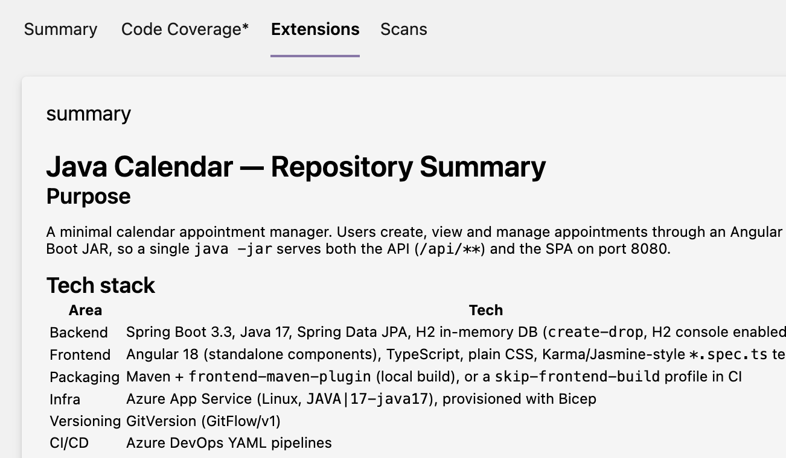
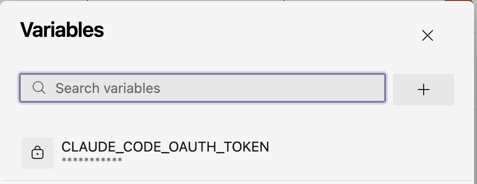
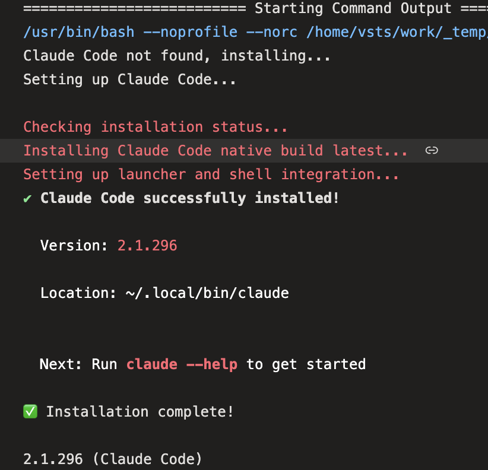

Claude Code is usually something you run in a terminal and talk to. It also has a
**headless mode** (`claude -p "<prompt>"`): it takes a prompt, works on the
current folder with the tools you allow, prints the answer and exits. Any CLI
that behaves like this can become a build step.

Headless mode is a natural fit for automation. Azure DevOps is the pipeline service
I use most, so I wanted a reusable way to run Claude Code there. In this example,
the prompt asks Claude to describe a test repository, but you can change it when
you run the pipeline without editing the YAML.



---

## Step 1 – Create a token for the build

> The first problem is: how can I login my claude with my claude code subscription instead of an API KEY?

The reason is simple, you should use your subscription credit, it is much more convenient. Luckily Claude Code has a specific command (used for GH Actions) that allows you to get a token bound to your subscription.

On your own machine, with Claude Code installed and logged in, run:

```bash
claude setup-token
```

This starts a browser login and prints a long-lived OAuth token that starts with
`sk-ant-oat01-`. The token is tied to your Claude subscription, so usage from the
pipeline counts against your account. Treat it like a password.

Claude Code reads this token from the environment variable
**`CLAUDE_CODE_OAUTH_TOKEN`**. No interactive login is needed on the agent.

## Step 2 – Store the token as a secret pipeline variable

In Azure DevOps, open the pipeline, then choose **Edit → Variables → New variable**:

- **Name:** `CLAUDE_CODE_OAUTH_TOKEN`
- **Value:** the token
- ✅ **Keep this value secret**



If several pipelines need the token, put it in a **variable group** (Pipelines →
Library) instead, optionally linked to Azure Key Vault. You have tons of way to securely store the token, the important aspect is that this **is a token bound to your subscription so it is not a standard API TOKEN, so it can be used by Claude Code only**.

## Step 3 – The pipeline

Here is the full YAML (`.azdo/azure-pipelines-claude.yml`). The default prompt
summarizes a repository, but the pipeline can run another task by changing the
prompt. The sections after it go through the important pieces.

```yaml
trigger: none   # run manually

parameters:
  - name: prompt
    displayName: Prompt for Claude Code
    type: string
    default: >-
      Summarize this repository: its purpose, tech stack, project structure,
      how it is built/tested, and how the CI/CD pipelines work.
      Answer in Markdown.

pool:
  vmImage: ubuntu-latest

stages:
  - stage: Claude
    displayName: Claude Code
    jobs:
      - job: runClaude
        displayName: Run Claude Code task
        steps:
          - checkout: self
            fetchDepth: 1

          - script: |
              set -euo pipefail
              export PATH="$HOME/.local/bin:$PATH"
              if command -v claude >/dev/null 2>&1; then
                echo "Claude Code already installed"
              else
                echo "Claude Code not found, installing..."
                curl -fsSL https://claude.ai/install.sh | bash
              fi
              echo "##vso[task.prependpath]$HOME/.local/bin"
              claude --version
            displayName: Install Claude Code (if missing)

          - script: |
              set -uo pipefail
              mkdir -p "$(Build.ArtifactStagingDirectory)/claude-output"
              OUT="$(Build.ArtifactStagingDirectory)/claude-output/response.md"

              # An undefined pipeline variable is passed through literally as "$(NAME)"
              if [ -z "${CLAUDE_CODE_OAUTH_TOKEN:-}" ] || [[ "$CLAUDE_CODE_OAUTH_TOKEN" == '$('* ]]; then
                echo "##vso[task.logissue type=error]CLAUDE_CODE_OAUTH_TOKEN is not defined."
                exit 1
              fi
              # Pasted secrets often carry stray spaces/newlines; strip them
              CLEAN_TOKEN="$(printf '%s' "$CLAUDE_CODE_OAUTH_TOKEN" | tr -d '[:space:]')"
              export CLAUDE_CODE_OAUTH_TOKEN="$CLEAN_TOKEN"

              # Mark the checkout folder as trusted in ~/.claude.json
              CFG="$HOME/.claude.json"
              [ -s "$CFG" ] || echo '{}' > "$CFG"
              jq --arg dir "$PWD" '.projects[$dir].hasTrustDialogAccepted = true' "$CFG" > "$CFG.tmp" && mv "$CFG.tmp" "$CFG"

              # Read-only tools only: Claude can explore but not modify the repo
              claude -p "$PROMPT" \
                --allowedTools "Read,Glob,Grep,Bash(git log:*),Bash(ls:*)" \
                --output-format text \
                < /dev/null > "$OUT" 2>&1
              RC=$?

              cat "$OUT"
              if [ $RC -ne 0 ]; then
                echo "##vso[task.logissue type=error]Claude Code exited with code $RC: $(head -c 300 "$OUT")"
                exit $RC
              fi

              echo "##vso[task.uploadsummary]$OUT"
            displayName: Generate response with Claude Code
            workingDirectory: $(Build.SourcesDirectory)
            env:
              CLAUDE_CODE_OAUTH_TOKEN: $(CLAUDE_CODE_OAUTH_TOKEN)   # secrets must be mapped explicitly
              PROMPT: ${{ parameters.prompt }}

          - publish: $(Build.ArtifactStagingDirectory)/claude-output
            displayName: Publish Claude Code output
            artifact: claude-output
            condition: succeededOrFailed()
```

### Install only if missing

Microsoft-hosted agents are fresh every time, so Claude Code is not present in such agents. On a **self-hosted agent** it's probably already installed, and the
`command -v claude` check skips the download. The official installer puts the
binary in `~/.local/bin`. The logging command `##vso[task.prependpath]` adds that
folder to the `PATH` of all the following steps.

The goal here is being able to download and install Claude Code if needed **so we do not require any prerequisite on the agent**. The scripts that are included in the example were made by Claude itself, and contains some sanification of the token (paste with trailing space etc.)



### Headless mode and a read-only tool allowlist

```bash
claude -p "$PROMPT" \
  --allowedTools "Read,Glob,Grep,Bash(git log:*),Bash(ls:*)" \
  --output-format text \
  < /dev/null
```

- `-p` (print mode) runs one prompt without the interactive UI and exits.
- `--allowedTools` is the security boundary. Claude can read and search files and
  run `git log`/`ls`, but it **cannot edit files or run arbitrary commands**. This
  is enough for read-only tasks. Widen the list only as far as the task needs.
- `< /dev/null` matters. In print mode, Claude Code waits a few seconds for
  data on stdin, which is how you pipe content in (`cat log.txt | claude -p "explain"`).
  On an agent nothing ever arrives, so redirect stdin and skip the wait.
- `--output-format text` gives plain Markdown. Use `json` if a later step needs to
  parse the result, for example to read cost or session metadata.

You can also give Claude full permission, but usually for a better security posture, it is better to have a way to limit what an agent that runs arbitrary prompt can do.

> This is an example, in reality it is not so secure having a build where everyone can change the prompt used for each run

The purpose of such pipeline is having some hardcoded prompt that runs against the code. Arbitrary prompt can be abused, imagine a run with: please zip all the code and then upload with curl to xxxxx

### Trusting the workspace

When you open Claude Code for the first time in a folder it ask you if you **trust the folder** but you do not have an interactive console during the build. Luckily this is just a simple entry in the user .claude.json global config file.

> For every configuration you wan to use, the pipeline can write directly in the user claude config file with jq.

```bash
jq --arg dir "$PWD" '.projects[$dir].hasTrustDialogAccepted = true' \
   ~/.claude.json > ~/.claude.json.tmp && mv ~/.claude.json.tmp ~/.claude.json
```

**IMPORTANT SECURITY CONSIDERATION**

This is another situation where you should be pretty sure that this pipeline is run from trusted source code, not from fork that can come from external sources. The reason is simple, claude is trusting the content of that folder **and if you run it inside a local agent, a malicious source file can compromise the agent**

### Making the output useful

Claude's response goes to three places:

| Where | How |
|---|---|
| Job log | `cat "$OUT"` |
| Run summary tab | `##vso[task.uploadsummary]$OUT` renders the Markdown on the run page |
| Artifact | `publish:` step with `condition: succeededOrFailed()`, so the output is kept even when the step fails |

The first image shows the output that is attached to the pipeline result

## Conclusions 

Thanks to the ability to use a 1 year token from your subscription for your Claude Code, plus the ability to call in commandline, integrating Claude Code in your workflow with Azure Pipeline is quite easy.

You should pay attention to security, avoid running custom prompt or running claude with too many permissions on code that it is not trusted if you run in your local agent.

If possible prefer Azure Agent or disposable agent in container, where after each execution the container is destroyed then recreated.

Have fun.

Gian Maria