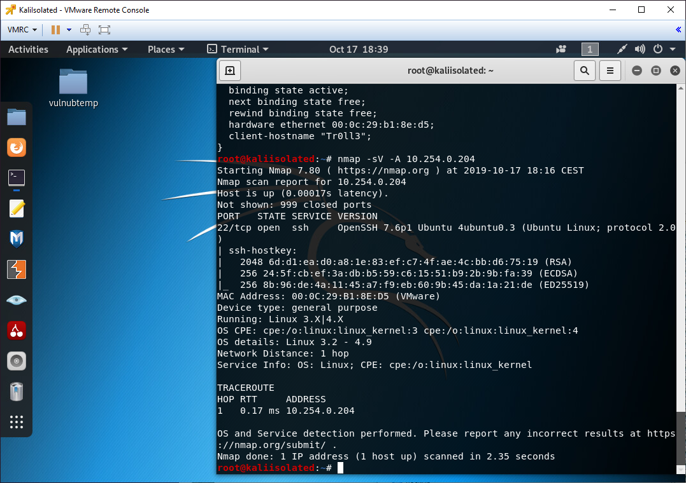
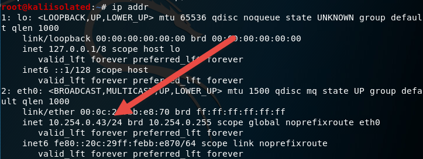
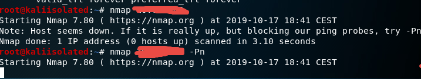
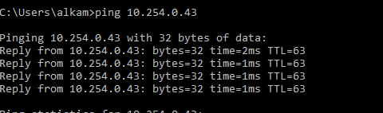

Security is one of my long passions, I’ve spent lots of time on C++ and Assembly (both x86 and other architectures) and in that environment I've started exploring buffer overflow and other vulnerabilities. Over the course of years security remained only a passion and not my primary skill, but I spent a good amount of time on it.

When it is time to study offensive security, it is quite common to **download and install test Virtual Machines, full of vulnerable software to do testing** and I’m quite surprised that most of the online tutorial simply tells you to use Virtual Box (rarely VmWare workstation) in a very basic way, and completely avoid exploring more advanced scenarios.

While most of these machines are pretty secure (I’m trusting VulnHub machines as an example), when you do security testing, it is quite risky to use your production environment as front Gun. It could be risky also to use a Virtual Machine if it is on the very same Network of your primary machines. 

> Using a Virtual Machine on the same Network Segment is not the most secure option.

Using client virtualization is not the safest option because there are possibilities that a VM can interfere with the host (spectre, meltdown, …) but the real problem is that the VM usually is in a virtual network that can communicate with other machines. If you fire a VM with Virtual Box, probably that machine can see all other machines in the network.

In my home office I have this setup, an old server (bough on www.itsco.de) and my old workstation as virtualization system, one is Hyper-V the other is VmWare ESXi, both of them having multiple NIC interfaces, Hyper-V server has 2 NICs while VmWare has 4 NICs. Having multiple NICs is the key to have security.

I have one public network, managed by crappy router of my ISP provider I cannot throw away for problem with VOIP (another story), in that public network I have cellular phone of my friend in a guest wireless (when they came visiting me at home) and another wireless for other device in house (XBox, etc).

Then I have a Microtik router that isolates that network from my home networks, where I have My Workstation and all VM I use for work. That network is sacred, I have everything that is important in that network, and it is isolated from public network by Microtik firewall, nothings came in, nothings came out.

Microtik routers are pretty powerful beasts, because for few bucks you have a SOHO router that allow me to create not only my private work network, but other ones, dedicated to experiments. One of these subnets is called “isolated” because it is an isolated network that can only use main ISP router to go in the internet, but cannot see anything in other networks, and other network cannot communicate with machines in isolated network.

This network is associated to a physical port of Microtik router, that is connected only with one card of my VmWare virtualization system, where I only deployed test machines and Security Related Machines. Now if I need to test some Vulnerable machine, I deployed them in VmWare ESXi machine, I associate it with the Isolated Network where I have a Kali Linux and other machines. The net result is that all machines in isolated network can communicate between them, they can communicate with the internet (updating my kali, communicating with test front gun server, etc), but they are completely isolated from my main network.

The only risk is for a VM to use some vulnerability of the CPU to compromise ESXi server, and from that server trying to compromise other machines. While this is a remote situation, I’ve configured the router to drop every traffic that originates from ESXi server to other machines in my work network.

Since I’m not a super network expert, this is probably not bulletproof, but it is really better than firing a vulnerable Virtual Machine in production hardware with vmware or VirtualBox.

Now only a question remains, if the Isolated Network is Isolated, how can I interact with machine in that network from other machines in work network? (After all I want to be able to fire my vulnerable and kali machine to experiment). Thanks to ESXi I can connect to the cluster from any other computer.

Figure 1: Accessing VM in isolated network from vmWare Remote conosle

Thanks to the remote console I can fully interact with machines, it supports live resizing and it is really responsive.

Figure 2: Isolated machines are deployed in a 10.254.0.0/24 network, isolated from other networks.

Issuing a Nmap against my domain controller returns no answer.

Figure 3: Machines in isolated network cannot contact other machines in the network.

Having a Microtik router allows me to play with firewall rules, as an example I have some dedicated IPs from the work network that can contact some of the machines in isolated networks, it can be useful from time to time.

Figure 4: With a specific network rule I can open access from work network to Isolated network for specific IP/port/protocol

Such setup allows me to experiment with machines / software that I download from the internet lowering the risks that this can impact my work network. Another benefit is that I can experiment with real different physical network, separated by physical routers real firewall etc.

I strongly suggest everyone that really wants to experiment with security related tasks to have physical setups.