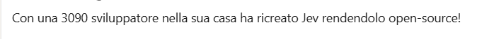

Ultimamente molti, ma veramente tanti, post su LinkedIn sembrano proprio scritti da AI, fatti da qualche prompt / hermes / openClaw etc. Una schedulazione che ha lo scopo di fare post con engagement e nulla di più, per cui trovi tra l'altro tutti a parlare dell'argomento del momento. Chiaramente questo contribuisce ad abbassare molto la qualità del contenuto dei post che si leggono su LinkedIn. 

Questo perché onestamente, se voglio avere un digest di quello che succede nel mondo, io ho i miei canali preferiti come ogniuno di noi, e vorrei invece usare LinkedIn o X (ma li oramai ho perso la speranza) per trovare spunti interessanti con esperienze personali. Per cui mi piacerebbe trovare il post di persone che, hanno provato nuove idee, librerie, etc, e vogliono condividere le loro esperienze reali. Quindi non cerco il post perfetto, non cerco il post che è "engaging" cerco **il sano e vecchio scambio di idee che è sempre stato la prerogativa del nostro lavoro, fatto da appassionati**.

Ho addirittura letto un post di una persona che tutta orgogliosa diceva di avere schedulato dei post con la AI per aver un profilo più interessante, come se a me interessasse perdere il mio tempo a leggere il profilo di qualcuno che fa pubblicare automaticamente la AI sul suo profilo. 

Tra l'altro se qualcuno magari risultasse interessato ad un profilo e chiedesse un contatto, mi chiedo poi, se si accorgerebbe che la persona deitro l'account è sicuramente differente. Tra l'altro chi fa generare i post dalla AI probabilmente non sa nemmeno rispondere ad una domanda su un suo post.

Mi immagino: Scusi ho visto che ha fatto una serie di post su Jev, cosa ne pensa quindi, quali sono i suoi feedback? Risposta: "Un attimo che i post me li fa Hermes per cui chiedo a lui".

Stamattina ecco l'incipit del primo post che leggo ... Al 99.99% fatto da AI.

**Immagine: Tipico post fatto da AI**

Come detto sopra, visto che l'argomento caldo è Jev abbiamo un bel post sull'argomento, generalista. Chiaramente la persona non sta condividendo esperienze personali ma sta cercando di generare engagement attraverso argomenti popolari con un post sintetizzato da AI.

Quindi? La soluzione? Non la conosco realmente tranne continuare a segnalare a linkedin che non mi interessano post fatti con la ai e continuare a smettere di seguire profili gestiti da AI. Perché alla fine tutti noi conosciamo i pochi reali account autentici che meritano attenzione, quelli spesso di persone che conosciamo realmente o comunque che seguiamo su altri canali e che comunque **sono persone che veramente sperimentano e condividono conoscenza**. Qundi alla fine a botte di "Smetti di seguire questo account" forse anche LinkedIn riuscirà a migliorare la qualità del feed.

Perché doveva essere un social di professionisti, ora il livello medio è "buongiornissimo caffè".

Gian Maria.

